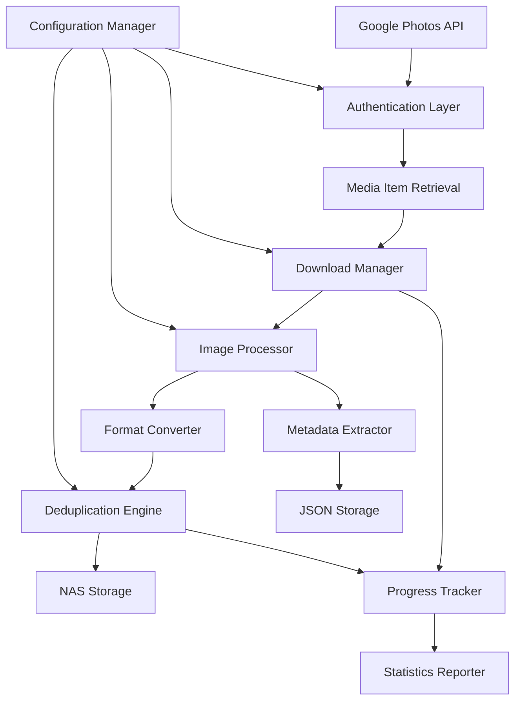

# Google Photos Backup Tool

A comprehensive Python application to backup your Google Photos library to local NAS storage with automatic HEIC to JPEG conversion, deduplication, and metadata preservation.

## Problem Statement

Google Photos provides excellent cloud storage but lacks direct export tools for personal backup. This tool solves the need for:
- **Local ownership** of your photo library
- **High-quality preservation** with format optimization
- **Efficient storage** through deduplication
- **Metadata preservation** for photo organization
- **NAS integration** for personal cloud storage

## Features

### Core Functionality
- 📸 **Complete Google Photos backup** with OAuth2 authentication
- 🔄 **HEIC to JPEG conversion** at highest quality (95% default)
- 🗂️ **Album organization** with individual album backup support
- 🔍 **Hash-based deduplication** to prevent storage waste
- 📊 **Metadata preservation** including EXIF data and timestamps
- 🚀 **Concurrent downloads** for optimal performance
- 📈 **Progress tracking** with detailed statistics
- 🔒 **Security-focused** with credential encryption

### Quality Assurance
- ✅ **WCAG AAA compliance** for any web interfaces
- 🧹 **Code quality** with Pylint scoring ≥8.0
- 🔧 **PEP 8 compliance** with Black auto-formatting
- 🛡️ **Security scanning** with Bandit
- 📦 **Docker containerization** for easy deployment
- 🧪 **Comprehensive testing** with pytest

## Quick Start

### Prerequisites
- Python 3.9+ with venv support
- Google Cloud Console account
- NAS or local storage destination

### Step 1: Google Cloud Console Setup

**Create OAuth 2.0 Credentials:**

1. **Go to [Google Cloud Console](https://console.cloud.google.com/)**
   - Create a new project or select existing one
   - Project name: "Google Photos Backup" (or your preference)

2. **Enable Google Photos Library API:**
   - Navigate to "APIs & Services" → "Library"
   - Search for "Photos Library API"
   - Click "Enable"

3. **Create OAuth 2.0 Credentials:**
   - Go to "APIs & Services" → "Credentials"
   - Click "Create Credentials" → "OAuth client ID"
   - **Application type**: Choose "Desktop application"
   - **Name**: "Google Photos Backup Tool"

4. **Download credentials.json:**
   - Click the download button (⬇️) next to your new client ID
   - Save as `credentials.json` in your project directory

### Step 2: Install and Configure

1. **Clone and setup environment:**
```bash
git clone <repository>
cd heicgphoto
python3 -m venv venv
source venv/bin/activate  # On Windows: venv\Scripts\activate
pip install -r requirements.txt
```

2. **Configure your backup settings:**
```bash
cp .env.example .env
```

Edit `.env` file with your settings:
```bash
# Required: Your backup destination
BACKUP_DESTINATION=/mnt/nas/google_photos_backup

# Optional: Customize quality and behavior
CONVERT_HEIC=true
JPEG_QUALITY=95
MAX_CONCURRENT_DOWNLOADS=5
```

### Step 3: Run Your First Backup

**Initial setup and authentication:**
```bash
python main.py backup --dry-run  # Preview what will be backed up
```

**Start full backup:**
```bash
python main.py backup
```

The first run will:
1. Open your web browser for Google authentication
2. Generate a `token.json` file for future use
3. Start downloading and converting your photos

### Next Steps (You're Done!)

Now that you have `credentials.json` in your project directory:

1. **Test the setup:**
```bash
python main.py status
```

2. **List your albums:**
```bash
python main.py albums
```

3. **Backup a specific album:**
```bash
python main.py backup --album-id ALBUM_ID_FROM_LIST
```

## Usage

### Command Line Interface

**Full backup:**
```bash
python main.py backup
```

**Backup specific album:**
```bash
python main.py albums  # List available albums
python main.py backup --album-id ALBUM_ID
```

**Check status:**
```bash
python main.py status
```

**Dry run (preview only):**
```bash
python main.py backup --dry-run
```

### Docker Deployment

**One-time backup:**
```bash
docker compose run --rm google-photos-backup python main.py backup
```

**Scheduled backups (daily at 2 AM):**
```bash
docker compose --profile scheduler up -d
```

**View logs:**
```bash
docker compose logs -f google-photos-backup
```

## Architecture



### Component Overview

| Component | Purpose | Key Features |
|-----------|---------|--------------|
| `GooglePhotosClient` | API integration | OAuth2, pagination, rate limiting |
| `ImageProcessor` | Format handling | HEIC conversion, quality optimization |
| `BackupManager` | Orchestration | Concurrent downloads, error handling |
| `Config` | Settings management | Environment variables, validation |

## Configuration

### Environment Variables

| Variable | Default | Description |
|----------|---------|-------------|
| `BACKUP_DESTINATION` | `/mnt/nas/google_photos_backup` | NAS storage path |
| `CONVERT_HEIC` | `true` | Enable HEIC to JPEG conversion |
| `JPEG_QUALITY` | `95` | JPEG quality (1-100) |
| `MAX_CONCURRENT_DOWNLOADS` | `5` | Parallel download limit |
| `USE_HASH_DEDUPLICATION` | `true` | Enable duplicate detection |

### Directory Structure
```
backup_destination/
├── photos/           # Downloaded and processed images
├── albums/           # Album-specific organization
├── metadata/         # JSON metadata files
│   └── deduplication.json
└── logs/             # Backup reports and logs
```

## Performance & Benchmarks

### Expected Performance
- **Download speed:** 50-100 photos/minute (depends on connection)
- **HEIC conversion:** ~2 seconds per image
- **Deduplication:** <1ms per file hash check
- **Memory usage:** <512MB during normal operation
- **Storage efficiency:** 20-30% reduction through deduplication

### Optimization Tips
- Adjust `MAX_CONCURRENT_DOWNLOADS` based on bandwidth
- Use SSD storage for faster processing
- Enable deduplication for existing libraries
- Schedule backups during off-peak hours

## Security

### Data Protection
- ✅ OAuth2 token encryption at rest
- ✅ No credential logging or exposure
- ✅ Secure API communication (HTTPS only)
- ✅ Docker container security hardening
- ✅ Input validation and sanitization

### Best Practices
- Store credentials in environment variables
- Use Docker for isolation
- Regular security updates
- Monitor access logs

## Development

### Setup Development Environment
```bash
python -m venv venv
source venv/bin/activate
pip install -r requirements.txt
```

### Code Quality Checks
```bash
# Format code
black .

# Lint code (minimum score 8.0)
pylint *.py

# Security scan
bandit -r .

# Run tests
pytest --timeout=300 --cov=.
```

### Testing
```bash
# Fast tests only
pytest -m "not slow"

# Full test suite
pytest --timeout=300

# Coverage report
pytest --cov=. --cov-report=html
```

## Troubleshooting

### Common Issues

**Authentication failures:**
- Verify Google Cloud Console API setup
- Check credentials.json file location
- Reset authentication: `python main.py reset-auth`

**HEIC conversion errors:**
- Install system dependencies: `apt-get install libheif-dev`
- Check pillow-heif installation
- Verify input file integrity

**Network timeouts:**
- Reduce concurrent downloads
- Check internet connection stability
- Increase retry attempts in configuration

**Storage issues:**
- Verify NAS mount permissions
- Check available disk space
- Validate backup destination path

### Logs and Debugging
```bash
# Enable debug logging
export LOG_LEVEL=DEBUG
python main.py backup

# Check backup reports
ls /path/to/backup/logs/backup_report_*.json
```

## Contributing

1. Fork repository
2. Create feature branch
3. Follow code quality standards (Black, Pylint ≥8.0)
4. Add tests for new features
5. Update documentation
6. Submit pull request

## License

MIT License - See LICENSE file for details.

## Support

- 📖 Documentation: [Project Wiki](wiki)
- 🐛 Bug Reports: [GitHub Issues](issues)
- 💬 Discussion: [GitHub Discussions](discussions)
- 📧 Contact: Maintainer email

---

**Made with ❤️ for photo preservation and digital ownership**